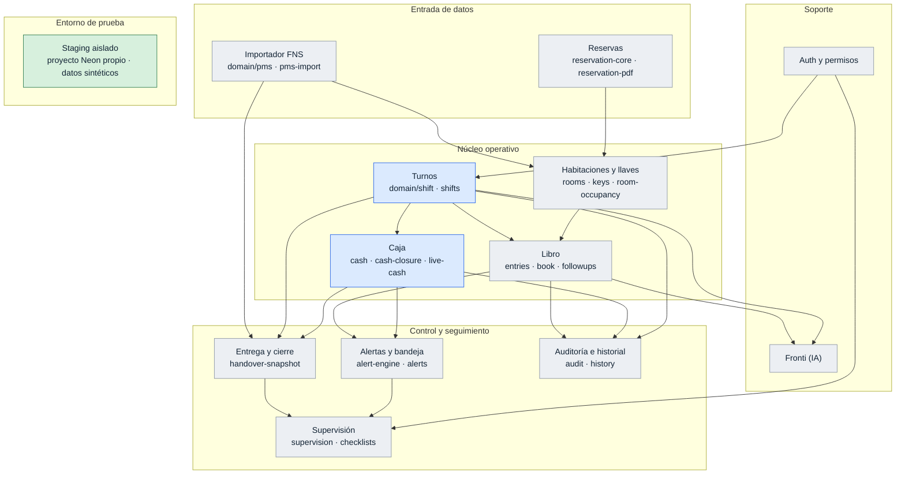

# Tablero de situación — Libro Operativo de Recepción

> Estado real del desarrollo. **No** es documentación técnica: para eso están
> `PROJECT_CONTEXT.md` y `docs/ARQUITECTURA.md`. Aquí sólo se responde «en qué
> punto está cada bloque».

Actualizado: **2026-09-18** · rama `refactor/turnos-solapados-caja` desde `e351f39`

## Estados canónicos

| Estado | Significa |
|---|---|
| `PENDIENTE` | Ni diagnosticado ni empezado |
| `DIAGNOSTICO` | Inspeccionado y con plan escrito; sin código |
| `EN_DESARROLLO` | Código en curso en una rama |
| `PR_ABIERTO` | PR hacia `preproduction`, sin mergear |
| `EN_STAGING` | Mergeado en `preproduction` y desplegado en staging |
| `VALIDADO_STAGING` | **Probado funcionalmente en staging por una persona** |
| `PRODUCTION` | Promovido a `main` y comprobado en Vercel Production |
| `BLOQUEADO` | Detenido por una causa externa nombrada abajo |

**Código escrito no es finalizado. Compuerta verde no es validado.**
`VALIDADO_STAGING` exige prueba funcional real. `PRODUCTION` exige promoción y
comprobación posterior en Vercel.

## Mapa de módulos

## Estado por bloque

| Bloque | Estado | Iteración / PR | Nota |
|---|---|---|---|
| Infraestructura de staging | `VALIDADO_STAGING` | #56 · #57 | Proyecto Neon aislado, 35 migraciones, seed sintético, cero datos de Production |
| Turnos + transferencia de Caja | `PR_ABIERTO` | #59 | Implementación en revisión; aún no validada en staging |
| ID FNS transversal | `PENDIENTE` | — | |
| Simplificación del Libro | `PENDIENTE` | — | |
| Caja unificada | `PENDIENTE` | — | |
| Habitaciones + Reservas | `PENDIENTE` | — | |
| Preparar entrega | `PENDIENTE` | — | |
| Validación integral en staging | `PENDIENTE` | — | Depende de todo lo anterior |

## Iteración actual

**Turnos solapados + transferencia explícita de Caja** — `PR_ABIERTO`

Un recepcionista entrante debe poder abrir su propio turno sin esperar el cierre
del saliente. La única transferencia obligatoria entre turnos es Caja, trazada y
sin autorización previa de Supervisión.

- Rama: `refactor/turnos-solapados-caja` desde `e351f39`
- PR: #59 (borrador; NO mergear todavía)
- Cambio estructural: **la unicidad global por hotel se reemplaza por
  exclusividad de participación activa por usuario, garantizada en base de datos
  sobre `ShiftAssignment`.** Se retira el índice
  `Shift_un_solo_turno_en_curso`; una persona no puede participar activamente en
  dos turnos a la vez, sea TITULAR o APOYO, y lo impide PostgreSQL, no el
  servicio

## Ya validado

- **Staging aislado de Production.** Proyecto Neon independiente, credenciales
  propias, 55 tablas, 35 migraciones registradas, 110 filas demo y **cero filas
  sin marca `isDemo`**. Verificado en el run del bootstrap y de forma
  independiente contra la base.
- **Compuerta operativa** sobre `preproduction` y `main`: lint, tipos,
  regresiones y build.

## Pendiente de staging

Nada desplegado a la espera de prueba funcional. El primer candidato será la
iteración de turnos + caja cuando su PR se mergee a `preproduction`.

## Bloqueos conocidos

| Bloqueo | Efecto | Se desbloquea con |
|---|---|---|
| Neon en plan **Free** | La rama `production` **no puede protegerse** (cupo de ramas protegidas = 0) y la retención de historial queda en 6 h | Cambio de plan |
| `DATABASE_URL` de Preview con alcance por rama en Vercel | Todo preview de una rama nueva falla en el build | Desactivar previews o corregir el alcance de la variable |
| Integración Neon–Vercel | Cada preview clona la rama `production`: hoy hay 6 ramas Neon con copia de datos reales | Desactivar el branching de preview en la integración |
| Netlify apunta a `main` en contexto `production` | Staging no está donde debe: la rama canónica debe ser `preproduction` | Cambio de rama canónica en el panel de Netlify |
| Vercel Production desalineado | Sirve `827fe9b`; `main` está en `cc5f6eb` | Relanzar Production sobre el SHA de `main` |

## Regla de mantenimiento

Cada PR funcional actualiza este archivo **en el mismo PR**, reflejando el avance
que ese PR produce y nada más. Si un bloque no cambió, su fila no se toca.
