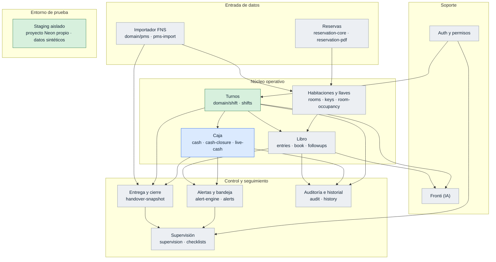

# Tablero de situación — Libro Operativo de Recepción

> Estado real del desarrollo. **No** es documentación técnica: para eso están
> `PROJECT_CONTEXT.md` y `docs/ARQUITECTURA.md`. Aquí sólo se responde «en qué
> punto está cada bloque».

Actualizado: **2026-09-18** · consolidación sobre Production `main@9555c977`

## Estados canónicos

| Estado | Significa |
|---|---|
| `PENDIENTE` | Ni diagnosticado ni empezado |
| `DIAGNOSTICO` | Inspeccionado y con plan escrito; sin código |
| `EN_DESARROLLO` | Código en curso en una rama |
| `PR_ABIERTO` | PR hacia `preproduction`, sin mergear |
| `EN_STAGING` | Mergeado en `preproduction` y desplegado en staging |
| `VALIDADO_STAGING` | **Probado funcionalmente en staging por una persona** |
| `PRODUCTION` | Promovido a `main` y comprobado en Vercel Production |
| `BLOQUEADO` | Detenido por una causa externa nombrada abajo |

**Código escrito no es finalizado. Compuerta verde no es validado.**
`VALIDADO_STAGING` exige prueba funcional real. `PRODUCTION` exige promoción y
comprobación posterior en Vercel.

## Mapa de módulos

## Estado por bloque

| Bloque | Estado | Iteración / PR | Nota |
|---|---|---|---|
| Infraestructura de staging | `VALIDADO_STAGING` | #56 · #57 | Proyecto Neon aislado, 35 migraciones, seed sintético, cero datos de Production |
| Turnos + transferencia de Caja | `PRODUCTION` | #59 · #60 | Lógica desplegada en Vercel Production; se corrige navegación heredada |
| ID FNS transversal | `PRODUCTION` | #64 · #67 · #68 | Núcleo de Reservas/RoomStay consolidado por ID FNS y proyectado a Production |
| Simplificación del Libro | `PENDIENTE` | — | Siguiente bloque funcional después de cerrar la consolidación técnica |
| Caja unificada | `PRODUCTION` | #63 · #67 · #68 | Cierre formal, arqueo por denominación, garantías y flujo integrado desplegados |
| Habitaciones + Reservas | `PRODUCTION` | #64 · #68 | Núcleo operativo por habitación e ID FNS desplegado |
| Preparar entrega | `PRODUCTION` | #66 · #67 · #68 | Anulación/retiro cierra participación y el flujo queda coherente con turnos solapados |
| Credenciales de Fronti | `EN_DESARROLLO` | rama `fix/fronti-provider-credentials-consolidado` | Rescata WIP abandonado: credenciales cifradas administrables sin desplegar |

## Iteración actual

**Consolidación de Fronti sobre Production** — `EN_DESARROLLO`

La auditoría de ramas confirmó que los bloques funcionales principales ya están en
`main`; las ramas antiguas son mayormente historia divergida y no se deben remezclar.
El único WIP útil detectado fuera de Production es la gestión de credenciales de
proveedor de Fronti. Se está reimplementando sobre el `main` actual, no por cherry-pick.

Regla vigente de despliegue:

`rama de trabajo → PR/Compuerta → main → Vercel Production → Neon production`

No hay previews automáticos de Vercel y no se crean ramas Neon por rama Git.

## Ya validado

- **Staging aislado de Production.** Proyecto Neon independiente, credenciales
  propias, 55 tablas, 35 migraciones registradas, 110 filas demo y **cero filas
  sin marca `isDemo`**. Verificado en el run del bootstrap y de forma
  independiente contra la base.
- **Compuerta operativa** sobre `preproduction` y `main`: lint, tipos,
  regresiones y build.

## Pendiente de staging

La lógica de turnos + Caja ya está en Production. La corrección actual elimina restos visuales heredados que contradicen el nuevo flujo.

## Bloqueos conocidos

| Bloqueo | Efecto | Se desbloquea con |
|---|---|---|
| Neon en plan **Free** | La rama `production` no puede protegerse y la retención de historial queda limitada | Cambio de plan |
| Límite diario de deployments Vercel Free | Un exceso de despliegues puede bloquear nuevos builds durante la ventana diaria | Evitar previews; sólo `main` despliega automáticamente |
| Credencial del proveedor Fronti | Hoy depende del entorno y obliga a redesplegar para cambiarla | Iteración actual: credencial cifrada administrable desde Fronti |

Estado de infraestructura verificado: **1 rama Neon (`production`)** y Vercel
Production sirviendo `main@9555c977`. Los deployments Preview históricos no son
fuente de verdad y no deben reactivarse.

## Regla de mantenimiento

Cada PR funcional actualiza este archivo **en el mismo PR**, reflejando el avance
que ese PR produce y nada más. Si un bloque no cambió, su fila no se toca.
